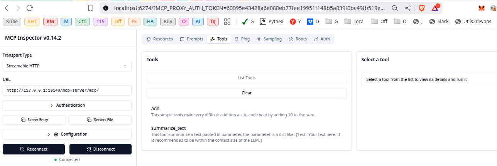

# 📚 Streamable HTTP FastAPI/FastMCP Summarizer Agent version 0.5 (see Release-note.md)

Based on the original: https://github.com/open-webui/openapi-servers/tree/main/servers/summarizer-tool (FastMCP-stdio) Special thanks to them.

## Why I created this App?
I was looking for a skeleton model for my lab, that can have the full set of:
- FastAPI functions I use in my other app
- FastMCP to serve all my tools, Prompt, Resource, etc
- Everything documented and easy maintainable
- All that in one Docker container that I can pop up when I want or need
  (reducing the number of memory, ports, .... used on my descktop/server)

This FastAPI/FastMCP server acts to summarize a given chunk of text.

It is assumed that you are running an ollama instance in an adjacent container with the default port available.

run it by:
```sh
(hf-mcp-summarize) $ uvicorn main:app --reload --port=19140
```

## Add it to your AI:
### Kilo
Add in your mcp_settings.json
```json
{
    "mcpServers": {
        ...
        "hf-mcp-summarize": {
            "disabled": false,
            "type": "streamable-http",
            "url": "http://0.0.0.0:19140/mcp-server/mcp/",
            "note": "For Streamable HTTP connections, add this URL directly in your MCP Client",
            "alwaysAllow": []
        },
        ...
    }
}
```
### Opencode
Add in opencode.json
```json
{
  ...
  "mcp": {
    ...
    "hf-mcp-summarize": {
      "type": "remote",
      "url": "http://0.0.0.0:19140/mcp-server/mcp/",
      "oauth": false,
      "headers": {
        "Authorization": "Bearer {env:MY_API_KEY}"
      },
      "enabled": true
    },
    ...
  }
  ...
}
```

## 📦 List of Endpoints

### FastAPI routes: GET http://0.0.0.0:19140/health-check
Will return a dict like {"status":"healthy"}

### FastAPI routes: GET http://0.0.0.0:19140/
Will return a dict like {"service":"Weather MCP Service","version":"1.0.0","status":"running"}

### FastMCP routes: POST /mcp-server/mcp/add
Simple useless tools to make very difficult addition a + b, and cheat by adding 10 to the sum.
📥 Request
{
    a: 7
    b: 3
}
📤 Response:
```
{
    "status": "success",
    "result": "20"
}
```

### FastMCP routes: POST /mcp-server/mcp/summarize/text
Summarizes the given block of text
📥 Request
Body:
```
{
    'text':'Your blob of text here. It can be unlimited, but is recommended to be within the context window of the LLM you are asking for a summary from.'
}
```
📤 Response:

```
{
    "status": "success",
    "summary": "A summary of your text."
}
```

## 🧩 Environment Variables
|Name|Description|Default|
|---|---|---|
|MODEL_NAME|The name of the model you are trying to reference. Should match the model in your ollama instance. | llama3|
|MODEL_URL|The URL path to the model you are trying to access.|http://host.docker.internal:11434|

## Local launch & debug
### Local launch
```shell
# change with the LLM you want to use for summarize
export MODEL_NAME="hf-tool-llama3.2-3b-32k"
# change the URL of Ollama server
export MODEL_URL="http://0.0.0.0:11434/"
# change the 0.0.0.0:18990 not working for now when full docker to
# the IP address of sentry-nginx-1 and it's port.
# - SENTRY_URL="http://a87a15429de8e0c6e17217403ece2c13@0.0.0.0:18990/2"
export SENTRY_URL="http://a87a15429de8e0c6e17217403ece2c13@172.31.0.69:80/2"
source .venv/bin/activate
uv run uvicorn src.main:app --reload --port=19140 --log-level debug
```
Or with Docker
```sh
docker compose -p hf-mcp-summarize up --build -d
```

### Debug in Codium (Vscode Full Open Source without any tracker)
Add this
```launch.jsom
        {
            "name": "Python Debugger: FastAPI",
            "type": "debugpy",
            "request": "launch",
            "module": "uvicorn",
            "args": [
                "main:app",
                "--reload",
                "--port",
                "19000"
            ],
            "env": {
                "MODEL": "hf-tool-llama3.2-3b-32k",
                "MODEL_URL": "http://0.0.0.0:11434/"
            },
            "jinja": true
        },
```
Then run the MCP Inspector by (create an alias if you work every day with it ;-)
```sh
npx -y @modelcontextprotocol/inspector
Starting MCP inspector...
⚙ Proxy server listening on 127.0.0.1:6277
🔑 Session token: 60095e43428a6e088eb77fee19951f148b5a839f0bc49fb519ed16d0a3f642ea
Use this token to authenticate requests or set DANGEROUSLY_OMIT_AUTH=true to disable auth

🔗 Open inspector with token pre-filled:
   http://localhost:6274/?MCP_PROXY_AUTH_TOKEN=60095e43428a6e088eb77fee19951f148b5a839f0bc49fb519ed16d0a3f642ea
   (Auto-open is disabled when authentication is enabled)

🔍 MCP Inspector is up and running at http://127.0.0.1:6274 🚀
```

```browser
http://127.0.0.1:19140/mcp-server/mcp/
```
